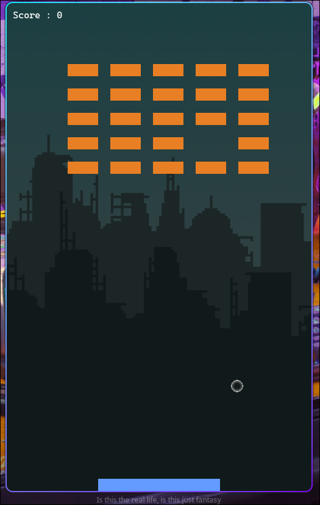

# Breakout SDL Game
A classic **Breakout** arcade game built in C using SDL3 and SDL3_ttf.

> **How to add a screenshot:** Run the game, press your OS screenshot key (e.g. `Print Screen` on Linux/Windows or `Cmd+Shift+3` on macOS), save the file as `screenshot.png` in the root of this repository, and commit it.
---
## Features
- Smooth 60 FPS game loop
- Ball & brick collision detection with proper bounce resolution
- Paddle controlled with keyboard (`A` / `D`)
- Score counter displayed in the top-left corner
- Background image and ball sprite loaded from PNG assets
- Background music (WAV) that loops automatically via SDL3 audio streams
---
## Dependencies
| Library | Version |
|---------|---------|
| [SDL3](https://github.com/libsdl-org/SDL) | 3.x |
| [SDL3_ttf](https://github.com/libsdl-org/SDL_ttf) | 3.x |
Install on **Ubuntu / Debian**:
```bash
sudo apt install libsdl3-dev libsdl3-ttf-dev
```
Install on **Arch Linux**:
```bash
sudo pacman -S sdl3 sdl3-ttf
```
---
## Building
```bash
make
```
This compiles `main.c` and produces the `main` executable.
### Run directly
```bash
make run
```
### Clean build artifacts
```bash
make clean
```
---
## Controls
| Key | Action |
|-----|--------|
| `A` | Move paddle left |
| `D` | Move paddle right |
| Close window / `Alt+F4` | Quit |
---
## Project Structure
```
breakout-sdl-game/
├── main.c                  # All game logic (single file)
├── Makefile
└── assets/
    ├── background.png       # Background image
    ├── ball.png             # Ball sprite
    ├── font.ttf             # Font used for the score display
    ├── skulls_adventure.wav # Background music (WAV)
    └── skulls_adventure.mp3 # Background music (MP3)
```
---
## License
This project is open source. Feel free to use and modify it.

